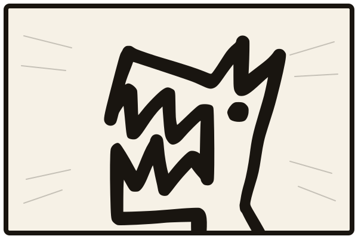

<div align="center">



# ruri

**One desktop workspace for all your projects — each a folder of live coding sessions.**<br>
*A folder-organized sidebar on the left, a real agent session on the right.*

</div>

---

ruri is a macOS desktop app (Electron) that hosts coding-agent sessions: Claude Code through [`@justin06lee/yagami`](https://github.com/justin06lee/yagami)'s `AgentSession` (your installed, signed-in `claude` CLI — settings, CLAUDE.md, skills, hooks and login identical to your terminal), and through yagami's provider layer any other harness you have installed — Codex, OpenCode, Gemini, any ACP agent — picked per chat from the same model dropdown. Sessions stay warm while you switch projects; closing the window keeps them alive, ⌘Q quits and tears them down.

## Run it

Requires macOS and a signed-in coding CLI (Claude Code, Codex, or an installed ACP agent).

```sh
make              # build → install ruri.app to /Applications → tidy → launch
make update       # stop the running app, rebuild, reinstall, tidy, relaunch
make build        # only the bundle, into dist-app/
```

The first `make` creates a local code-signing identity (`ruri dev`) in your login keychain, so macOS privacy grants survive rebuilds — see [docs/permissions.md](docs/permissions.md). The app is not notarized (no Apple developer account); it is installed by `make`, never downloaded.

For development:

```sh
bun install
bun run dev       # browser mode: server on :7777, UI at http://localhost:5173
bun run desktop   # the desktop app unpackaged (built UI + Electron)
```

## What it does

- **Home, the workspace agent** — tell it what to work on and it finds the projects by name, opens them in the sidebar and kicks their sessions off, on whatever model you point it at.
- **Projects are folders of parallel sessions** — auto-named after their first turn, warm in the background, resumed after a relaunch; idle ones give their process back and resume on the next prompt.
- **Any harness, verbatim** — Claude, Codex, OpenCode, Gemini, ACP agents; model, reasoning effort and permission mode are per chat — and every one of them kept up to date on the hour, the way it was installed.
- **Streaming markdown replies** with tool chips, inline diffs, previews of what was read, and permission cards that mean the same thing on every harness.
- **An app-side prompt queue** you can reorder, merge (with an undo) and edit while a turn runs — or cut in past it with ⌘Enter or a held Enter, stopping the answer and sending yours in its place. A dropped connection or a usage limit holds it, with a Send queued button, instead of spending it against the same wall; a prompt splitter; slash commands inside a prompt.
- **Attachments** — images, videos, PDFs, files — with markers as chips, region crops, a full-size viewer and a sketch pad.
- **Edit & rewind** with ruri's own checkpoints on every harness — the discarded turns' files, commits and context go back, and nothing else does; fork a chat at any exchange; import chats started outside ruri.
- **MCP servers, plugins and marketplaces** for Claude Code and Codex, listed, added and removed from Settings through each CLI's own commands.
- **Subagents and background scripts as live cards**, an agents page, and agents of your own started from a brief; an agent the model sends on again picks its own card back up.
- **Agents talk to agents** — a chat's agent can message a chat in any open project and hear back, waiting on the answer or having it come later; the talk page in every chat's header says who may message whom, and outside Bypass each message waits on your OK.
- **The bridge** — a session looks at and drives what it built: a hidden browser window over CDP, native apps over Accessibility, previews above the composer.
- **ruri's own `/compact`** — instant and token-free, built from per-turn recall notes; transcripts split into a live part and a capped history.
- **A component library per project** — every piece of its interface with a picture, a name and its code, in a searchable gallery; agents find, read and install components with the `ruri` command (`ruri search`, `ruri show`, `ruri add peek-band`) and put back what they build.
- **A project's memory and architecture** — every chat is pointed at `.ruri/catchup.md` (git's own account of where things stand, then decisions and why, what worked, what failed and why, the traps, what's open — each line with the day it was learned, the exchange it came from and who wrote it) and `.ruri/architecture.md` — the index: the stack as layers, the flows across them, where things are. Every session is shown the stack before it starts, and each layer has a sheet of its own in `.ruri/layers/` (where to change what inside it, how it works, its key files, its traps) that a session reads before working in that layer — so a project grows by gaining layers, not by its sheets growing, and a turn only folds into the sheets of the layers whose files it changed. Agents add what they learn with `ruri note`, read a layer with `ruri layer <handle>`, search every past exchange with `ruri recall`, and read git and their own changes with `ruri state`; the Architecture page draws the stack, each bar opening its layer's sheet, and there you rewrite or strike any line.
- **Turn memory, a feature tracker, an ideas board, the vault** (secrets the model can use but never read) **and a skills page.**
- **Shells in the composer** on a real pty, a tab row per project; **rapid fire** for assembly-line prompting across sessions.
- **Questions never go to a hole** — every harness's question and form elicitation shares one card.
- **A manga look** on warm paper, three themes on a clock, the dragon gauges for context and account limits, the peek band in the title bar (the hand-cut heads, or any pictures and GIFs you give it, each with its own hover), a hero face per project (the twelve Ruris or your own, one always or drawn at random, framed and dressed as you like), a music player in the sidebar, and an art tuner.
- **Settings → Permissions** shows every macOS grant as macOS actually holds it.

The long form, one bullet per capability: [docs/features.md](docs/features.md).

## Architecture

```
ruri.app (Electron)
  ├─ main process: startServer() in-process        ─┐
  │    └─ yagami AgentSession → Agent SDK           ├─ one WebSocket + static UI
  │       → your installed claude CLI               │  on one localhost port
  └─ renderer: React + Vite + zustand (dist-web)   ─┘  (shared/protocol.ts)
```

One HTTP server on `127.0.0.1` carries everything: the built UI, uploads, music, the bridge's HTTP face, and the WebSocket. `shared/protocol.ts` is the single wire contract; `server/` is the backend (sessions, archive, compaction, the small-model layer, the Home agent, the bridge tools), `web/src/` the React UI, `desktop/` the Electron shell (window, permissions, hidden bridge windows, native apps, screenshots). `scripts/build-main.ts` bundles main process, server, yagami and the Agent SDK into one file, so the packaged app ships no node_modules; the Claude engine is your installed `claude` binary, found on your login shell's PATH.

All state lives under `~/.config/ruri` (`RURI_CONFIG_DIR` moves it). Each project gets a self-ignoring `.ruri/` folder for its catch-up, its architecture (the index and a sheet per layer) and its component library — once there is something in it: a folder that is still blank is left blank, so `create-next-app`, `bun create` and `git clone` run in it as they would anywhere.

- [docs/architecture.md](docs/architecture.md) — the per-file walk, where things live on disk, environment variables, and the security model
- [docs/features.md](docs/features.md) — everything it does, in full
- [docs/testing.md](docs/testing.md) — every script, and which spend tokens
- [docs/permissions.md](docs/permissions.md) — the macOS grants and the signing identity
- [docs/harness-integration.md](docs/harness-integration.md) — non-Claude harnesses through yagami
- [docs/roadmap.md](docs/roadmap.md) — not yet
- [CHANGELOG.md](CHANGELOG.md), [CONTRIBUTING.md](CONTRIBUTING.md)

## Testing

```sh
bun run typecheck && bun run lint
bun test                 # unit tests, **/*.test.ts
bun run test:scripts     # the token-free integration scripts, one after another
bun run build            # the packaged app must still build
```

CI runs the same on every push to `master` and every pull request. The scripts that spend tokens (`bun run smoke`, the live agent tests, …) or need a display (`bridge-test`, `chips-test`) are run by hand; [docs/testing.md](docs/testing.md) lists each with its cost.

## License

MIT — see [LICENSE](LICENSE).
