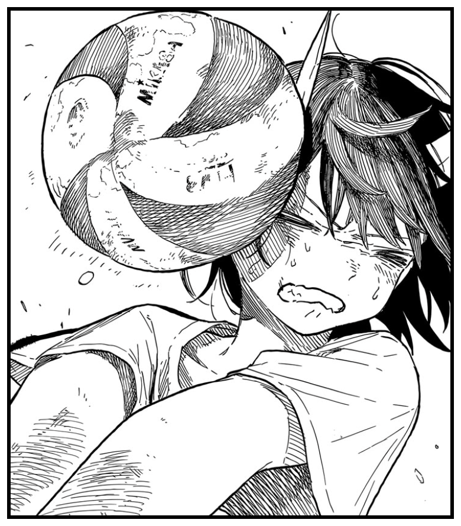

<div align="center">



# ruri

**One desktop workspace for all your projects — each with its own live Claude Code session.**<br>
*A folder-organized sidebar on the left, a real Claude Code session on the right.*

</div>

---

ruri is a macOS desktop app (Electron). Sessions run through [`@justin06lee/yagami`](https://github.com/justin06lee/yagami)'s `AgentSession` (the Claude Agent SDK pointed at your installed, signed-in `claude` CLI, `claude_code` system prompt preset, terminal parity) — so behavior, settings, CLAUDE.md, skills, hooks, and login are identical to your terminal, just with one UI over all of them. Sessions stay warm per project: switch projects instantly while agents keep working in the background, with activity dots in the sidebar. Closing the window keeps sessions alive (the Dock icon reopens it); ⌘Q quits and tears them down.

## Run it

```sh
make            # build → install ruri.app to /Applications → launch
make update     # stop the running app, rebuild, reinstall, relaunch
```

Requires a signed-in Claude Code CLI (yagami comes from npm as `@justin06lee/yagami`). The packaged app bundles the whole backend into one file and ships no node_modules; the Claude engine is your installed `claude` binary, resolved at runtime (with your login shell's PATH, so tools inside sessions behave like your terminal).

For development:

```sh
bun install
bun run dev       # browser mode: server on :7777, UI at http://localhost:5173
bun run desktop   # run the desktop app unpackaged (built UI + Electron)
```

## What it does

- **Native desktop app** — `ruri.app` with Dock icon, single-instance, inset title bar; the window serves the UI and WebSocket from one local port picked at launch.
- **Projects sidebar** with optional folder grouping, add/remove, status dots (blue pulse = working, amber = waiting on a permission, red = error, ring = unread activity in a background project).
- **One persistent Claude Code session per project** (streaming input, so you can send follow-ups mid-run to steer). Sessions start lazily on first message, run in the project's directory, and auto-restart with `resume` if they die — context carries over.
- **Streaming responses** (token deltas), tool-use chips (`Bash — npm test`), and per-turn result lines with duration and what the turn would have cost at API prices.
- **Permission prompts**: when Claude Code would ask in the terminal, ruri shows an Allow/Deny banner instead (your `~/.claude/settings.json` allow-rules apply exactly as in the CLI).
- **Interrupt** button to stop a running turn.

## Architecture

```
ruri.app (Electron)
  ├─ main process: startServer() in-process        ─┐
  │    └─ yagami AgentSession → Agent SDK           ├─ one WebSocket + static UI
  │       → your installed claude CLI               │  on one localhost port
  └─ renderer: React + Vite + zustand (dist-web)   ─┘  (shared/protocol.ts)
```

- `server/server.ts` — importable `startServer()`: WebSocket hub + static file serving for the built UI; snapshot on connect, broadcasts events/deltas/statuses/permissions, handles client commands.
- `server/sessions.ts` — per-project session lifecycle on yagami's `AgentSession` (warm process, terminal parity, `appName: "ruri"`): SDK message → transcript event translation, permission plumbing (with the CLI's suggested "always allow" rules), model/permission-mode switching, resume-on-restart.
- `server/index.ts` — standalone entry for dev/smoke (same server, no Electron).
- `desktop/main.ts` — Electron main: login-shell PATH recovery, window/menu/lifecycle; esbuild bundles it together with the server, yagami, and the Agent SDK into a single file (`scripts/build-main.ts`).
- `web/src/store.ts` — zustand store fed by the socket; drafts (streaming text) are kept separately from finalized transcript events.
- Projects persist in `~/.config/ruri/projects.json`. Chat transcripts are in-memory for now (Claude Code's own session files in `~/.claude` persist, and sessions resume across restarts).

## Testing

```sh
bun run typecheck && bun run build   # no tokens; build produces dist-app/mac-arm64/ruri.app
bun run smoke                        # live E2E: 3 real turns incl. Bash + permission round-trip

# same E2E against the packaged app (Finder-style stripped PATH recommended):
RURI_SMOKE_SPAWN="dist-app/mac-arm64/ruri.app/Contents/MacOS/ruri" bun run smoke
```

## Not yet (iterate next)

Markdown rendering, tool results/diffs in the transcript, plan-mode & model/effort controls, transcript persistence, session history browser, drag-and-drop folder management, git status in the sidebar, worktree support for parallel agents in one repo, notifications, Windows/Linux packaging.
